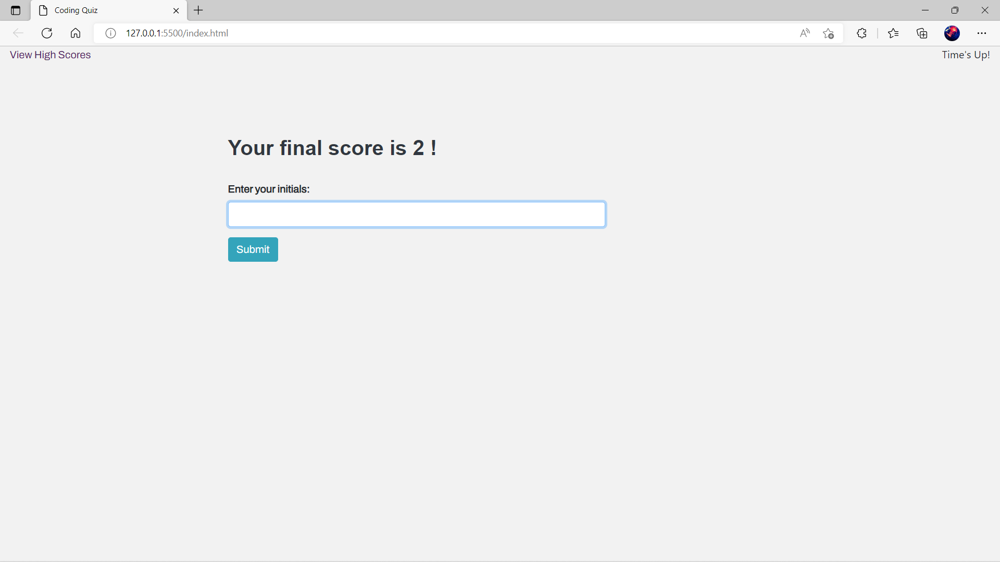

# 04 Web APIs: Code Quiz 
## Description of the activity

This is a timed coding quiz with multiple-choice question about JavaScript fundamentals that store high scores.
## Screenshots

## Page Link 

[Page link]()